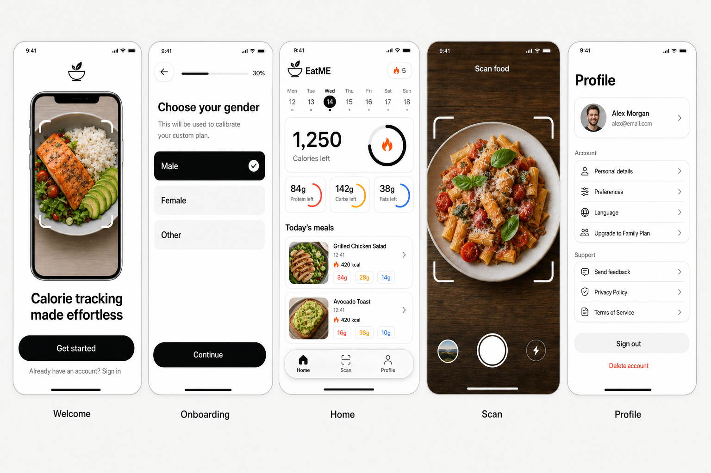

# EatME

**AI calorie tracker built with Expo (React Native).** Snap a photo of your meal — an AI agent estimates
the calories, protein, carbs and fat — and track it against a daily plan that AI builds for you during
onboarding.

<p align="center">
  
</p>

- **Product plan & every decision:** [`PLAN.md`](./PLAN.md)
- **Agent / contributor instructions:** [`AGENTS.md`](./AGENTS.md) (`CLAUDE.md` imports it)
- **Design references + prompts:** [`design/`](./design)
- **Landing page, privacy policy, terms:** [`legal/`](./legal)

## Stack

The whole backend is **one Railway project + OpenRouter** — no other accounts.

| | |
| --- | --- |
| App | Expo SDK 57, React Native, Expo Router (native tabs), NativeWind v4, TanStack Query, Zustand |
| Sign-in | Better Auth — email + password, sessions in Postgres |
| Server | Expo Router API routes (`src/app/api`), run on Railway by `server/index.mjs` |
| Database | Railway Postgres + Drizzle ORM |
| Photos | Railway storage bucket (private, S3-compatible; the app gets signed links) |
| AI | `openai/gpt-5.6-luna` via OpenRouter (OpenAI SDK) — runs inside the server |
| Monitoring | Sentry, optional (errors, logs, tracing, session replay, user feedback) |
| Legal site | Static HTML in `legal/`, served by the same Railway server |

## How it works

```
Onboarding answers ──▶ POST /api/plan ──▶ OpenRouter (GPT) ──▶ daily targets (formula fallback)
Sign up (email + password) ──▶ /api/auth/* (Better Auth) ──▶ POST /api/onboarding ──▶ Postgres

Photo ──▶ POST /api/meals ──▶ bucket + meal row ("analyzing") ──▶ background AI analysis
            ▲                                                          │
            └──────── app polls GET /api/meals/:id ◀── calories + macros saved
```

## What it does

- **Log a meal** by photo (up to 3 angles of one meal, still one scan), nutrition-label photo, a typed
  or dictated description, a **barcode** (Open Food Facts, USDA Branded Foods fallback; the source is
  shown and a wrong product can be reported), a **USDA food search** or **quick add** (type calories and
  macros) — the last three need no AI. Photos and descriptions are split into foods matched to the USDA
  FNDDS database, so the numbers (and vitamins and minerals) come from the database where a food
  matches; grams and foods can be edited, and corrections can be **remembered** ("Your foods") so the
  next scan uses your version first. Behind a flag, the AI can ask one tap-to-answer question (cooking
  fat, portion, filling).
- **Daily picture:** calories and macros against a plan built at onboarding (your own goals allowed,
  with safety floors), fiber and water, a protein hint per meal, weekly insights, **vitamins &
  minerals** against the DRIs, a **supplements** log with upper-limit notes, **weight** with a trend
  line, milestones (never below BMI 18.5) and a weigh-in reminder. **Calm mode** hides calorie and
  macro numbers and counts days logged instead of a streak.
- **Habits:** log again, copy any of the last 14 days (all meals or some), favourites, **saved meals**
  that can repeat on chosen days (suggested on Home, never logged without a tap), portions, reminders
  (local notifications), GLP-1 mode (dose day, side effects; no dosing advice), Apple Health / Health
  Connect sync (write only) and an iOS water widget.
- **Account:** email + password with optional email codes (forgot password, verification), optional
  Sign in with Apple / Google, and optional EatME Premium (store billing through RevenueCat; free
  users keep a few AI scans a day and everything else). An opt-in food-quality tag is available as
  an experiment. Everything optional is off until configured (`GET /api/features`).

## Setup

You need Node.js 22+, and Xcode (iOS) or Android Studio — or an [EAS](https://expo.dev/eas) account to
build in the cloud.

```bash
npm install
cp .env.example .env
```

1. **Railway** — the project `eatme` has three pieces: the **api** service (this repo), **Postgres** and
   the **meal-photos** bucket. The api service's variables reference the other two, so production needs
   nothing else. For local development copy into `.env`:
   - `DATABASE_URL` — Postgres → *Connect* → public connection URL, with `?sslmode=no-verify` appended
     (enable the TCP proxy / public networking on Postgres if there is no public URL yet).
   - `S3_ENDPOINT`, `S3_BUCKET`, `S3_ACCESS_KEY_ID`, `S3_SECRET_ACCESS_KEY` — bucket → *Credentials*.
2. **OpenRouter** — `OPENROUTER_API_KEY`. `AI_MODEL` / `AI_VISION_MODEL` default to `openai/gpt-5.6-luna`.
3. **Sign-in** — `BETTER_AUTH_SECRET` (any long random string: `openssl rand -hex 32`),
   `BETTER_AUTH_URL=http://localhost:8081`.
4. **Sentry** (optional) — `EXPO_PUBLIC_SENTRY_DSN` from a *React Native* project.

The server creates the database tables and loads the USDA food database (`data/fndds.json.gz`) itself
when it starts; to do it by hand run `npm run db:migrate` and `npm run db:foods`.

## Run it

**Quickest way to try it (free, on your phone):** install **Expo Go**, then

```bash
echo "EXPO_PUBLIC_API_URL=https://api-production-174d.up.railway.app" > .env
npx expo start --go --tunnel   # scan the QR code with the phone camera
```

The app then uses the live Railway server (sign-in, AI, photos) and needs nothing else locally —
`--tunnel` lets a phone reach a dev server that is not on the same Wi-Fi (e.g. GitHub Codespaces).
Signing in from Expo Go needs `ALLOW_EXPO_GO=true` on the Railway server (already set).

Everything works in Expo Go except the parts that need native code EatME brings along: **Apple
Health / Health Connect sync**, the **iOS water widget**, **Sign in with Apple / Google** and
**Premium purchases** (Profile → Health apps explains this in the app). Reminders and barcode
scanning do work in Expo Go.

For the full app (its own icon, Sentry crash reports, Health sync, the widget) use a **development build**:

```bash
npx expo run:ios          # or: npx expo run:android  (or: eas build --profile development)
npx expo start            # the dev server runs the app AND the API routes — one terminal
```

Leave `EXPO_PUBLIC_API_URL` empty to run the API routes on your own dev server instead (needs the server
variables from step 1–3).

In the simulator the camera is black — use **Choose from gallery** on the Scan tab. Want data without
scanning? `npm run db:seed -- --email you@example.com` adds two weeks of sample meals.

## Deploy

| Piece | How |
| --- | --- |
| Server, database, photos, legal pages | Push the branch — Railway builds (`npm run build:server`), runs migrations and starts `server/index.mjs` (`railway.json`). Health check: `/api/health`. |
| App | `npx eas-cli@latest build --profile production` and `eas submit`. The `preview` and `production` profiles in `eas.json` already point the app at the Railway URL. |

Before submitting to the App Store: **Delete account** is in Profile, the Privacy Policy / Terms links
work, the placeholders in `legal/` are filled in, App Review gets a test email + password, and the
Railway variable `ALLOW_EXPO_GO` (lets Expo Go sign in while testing) is removed. The App ID needs the
HealthKit, App Groups (widget), Sign in with Apple and Push Notifications capabilities (EAS sets them from
the entitlements); Google Play needs the Health Connect declaration for writing nutrition and hydration.
Optional services (email codes, Apple / Google sign-in, Premium, the food-quality experiment) each have
their variables in `.env.example` and a checklist item in `PLAN.md` §10.

## Scripts

| Command | What it does |
| --- | --- |
| `npm start` | Expo dev server (app + API routes) |
| `npm run ios` / `npm run android` | Build and run the development build |
| `npm run build:server` / `start:server` | Export the API routes / run the production server (as on Railway) |
| `npm run lint` / `npm run typecheck` | ESLint / TypeScript |
| `npm run db:generate` / `db:migrate` / `db:push` / `db:studio` | Drizzle migrations and database browser |
| `npm run db:seed -- --email you@example.com` | Sample meals for testing |

## Project structure

```
src/app/            screens and layouts (Expo Router) + API routes in src/app/api
src/components/     UI (ui/ primitives, home/, scan/, onboarding/, pickers/, profile/)
src/lib/            client helpers (API client, sign-in client, queries, stores, Sentry, formatting)
src/lib/server/     server-only helpers (auth, storage bucket, AI plan, meal analysis, account deletion)
src/shared/         zod schemas + nutrition math shared by the app and the server
src/db/             Drizzle schema and client
server/             production server for Railway
drizzle/            SQL migrations
design/             AI-generated UI references (and the prompts that made them)
legal/              landing page, privacy policy, terms of service
```

## Notes

- **Limits:** 10 plan requests per hour per IP, 50 scans a day per account, and Better Auth's sign-in rate
  limiter — they keep the AI bill predictable. One plan or meal analysis costs a fraction of a cent.
- **Resilience:** AI calls are retried; a meal analysis that a restart or deploy interrupted is picked up
  again the next time the app loads meals.
- **Optional services:** email codes for "Forgot password?" and email verification (Resend:
  `RESEND_API_KEY`, `EMAIL_FROM`) and a USDA key for barcode fallbacks (`FDC_API_KEY`). The app hides what
  the server hasn't set up (`GET /api/features`). See the roadmap in `PLAN.md`.
- **Product reports:** "Report a problem" on a barcode product never changes logged meals; the next lookup
  fetches the product again (at most once a day) and closes the reports if the source changed. Review the
  open ones in the Railway database (Data → Query):

  ```sql
  select r.code, p.name, p.source, r.reason, count(*) as reports, max(r.updated_at) as latest,
         string_agg(nullif(r.note, ''), ' | ') as notes, p.flagged_at is not null as flagged
  from product_reports r join products p on p.code = r.code
  where r.status = 'open'
  group by r.code, p.name, p.source, r.reason, p.flagged_at
  order by reports desc, latest desc;
  ```

  After fixing a product at Open Food Facts (or confirming it is right), close its reports with
  `update product_reports set status = 'resolved' where code = '…';` and
  `update products set flagged_at = null, recheck_at = now() where code = '…';`.
- **Measure first (PLAN.md §16):** the share of people using GLP-1 mode, to decide where GLP-1 mode+
  goes. Leave your own team's accounts out by email:

  ```sql
  select count(*) filter (where glp1 is not null) as glp1_mode,
         count(*) as onboarded,
         round(100.0 * count(*) filter (where glp1 is not null) / nullif(count(*), 0), 1) as percent
  from users
  where onboarding_completed_at is not null
    and email not in ('you@example.com');
  ```
